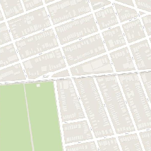
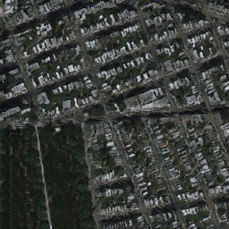
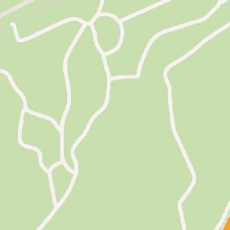
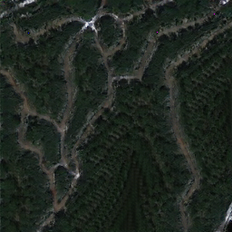
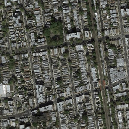
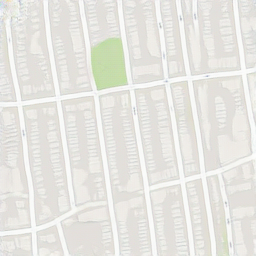
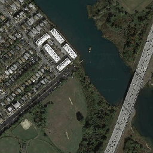
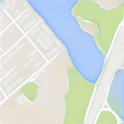
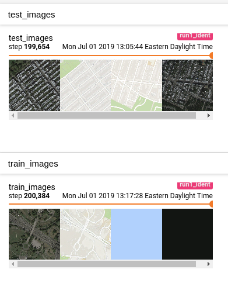

# PyTorch CycleGAN

Minimal implementation of [Unpaired Image-to-Image Translation using Cycle-Consistent Adversarial Networks](https://arxiv.org/pdf/1703.10593.pdf). 

Results on Google Maps dataset (Real/Generated):

  
  

  
  

  
  

  
  

These transformations are learned *unpaired* - the satellite and Google maps images are presented independently to the model.

## Data Format

    dataset_dir
    |__trainA
    |__trainB
    |__testA
    |__testB

## Running
Required:

 - Python 3+
 - PyTorch 1.0.1+
 - tensorboardX 

`python train.py <run_name> --data dataset_dir --identity-loss --gen-buffer`

Generated images are displayed in Tensorboard (real/generated/real/generated):

  

